# angular-module-starter
A starter-kit to create reusable Angular modules. Uses Angular CLI to create module, services, and components. You can use the start kit to quickly create a new Angular module project. If you want to create your own from scratch using Visual Studio Code with Angular CLI, use the instructions below. Enjoy your modules!

# How to Create a Custom Angular Module

The information in this guide will show you how to create a custom module that can be used and/or shared by different Angular projects. You will learn how to:

1. Create a custom module that can be published to [https://www.npmjs.com/](https://www.npmjs.com/) for use by other projects. 
2. Create sharable components and classes (models) for your custom module - using the Angular CLI.
3. Use your module in other Angular web applications via a package.json reference. 

## Why Create Custom Angular Modules?
The whole notion of modules is to create reusable items to improve efficiency and minimize maintenance of source code. The base element of an Angular application is a Module. Each Angular application contains an app.module that is the entry point of the entire application. Therefore, you are already familiar with using modules. Also, it is very common to create additional modules in an Angular applications. However, what if you want to create Angular modules that can be reused in more than a single Angular application? Or, if you also want create custom modules that can be published to NPM and shared with the world? 

For example, my team is now finishing up the second of two enterprise Angular applications within 9 months. During the development of the second application we noted that there were some things in the first application that we wished we could use in the new application. And now that we are finishing up the second application, there are even more ` elements ` that we want to make reusable for future projects. The best way to do this is to create reusable packages - custom Angular modules.

## Scope of Solution
The scope or context of this information is creating custom modules that contain reusable ` elements ` for Angular web applications. This module will demonstrate how to create a reusable module that contains either services or components.

Just today our team designed a custom submit button that changes state and shows a spinny icon while submitting to the back end of the application. The problem with most buttons is when do you enable the button to be submittable (when the form is valid, right?). And after you have clicked the button, you want to restrict users from re-clicking the Submit button. Our new Submit button ` component ` can now be used by all forms in different applications. But only, if we include it in our custom UI module. Developing shared module packages allows you to create something that can be used everywhere, but maintained in a single location. And now, when you want to add more features to the component, add the feature and bump the version number of the module. You now also have backward compatibility for other applications using the older version. Nice!

You will need to determine how you manage versions of the module if you are not publishing to [https://www.npmjs.com/](https://www.npmjs.com/). NPMjs already has built-in version management for your NPM packages/modules. 

## Tools
The examples demonstrated will use [Visual Studio Code](https://code.visualstudio.com/download) and other tools listed below to create the solution. Your development environment should have the following installed and configured.  

* node.js and npm
    * Download at: [https://nodejs.org/en/download/](https://nodejs.org/en/download/)
* Typescript
    * Install using npm: `npm install -g typescript `

### Angular CLI
You are probably familiar with the Angular CLI tool - a command line interface for Angular. More information at: [https://cli.angular.io/](https://cli.angular.io/). It has many different features that allow you to create new applications, build and service apps, testing, linting, and formatting. You can also use to generate (or scaffold) modules, services, components, classes, directives, interfaces and more. You can get a lot of mileage out of tools like this.

## Getting Started
Use the following 10 steps to create a new module project. The instructions provide enough details for you to create a module of (2) different types. Step 8 has information on creating (2) different types of modules - each has a different responsibility within the architecture of the application. 

1. UI Modules
2. Service Modules

### 1. Create Directory for Module Project
Within Visual Studio Code, open the Powershell Terminal (` CTRL+`). Change to a directory where you want to create the module project. Create a folder for the project. 

```script
mkdir ng-common
```

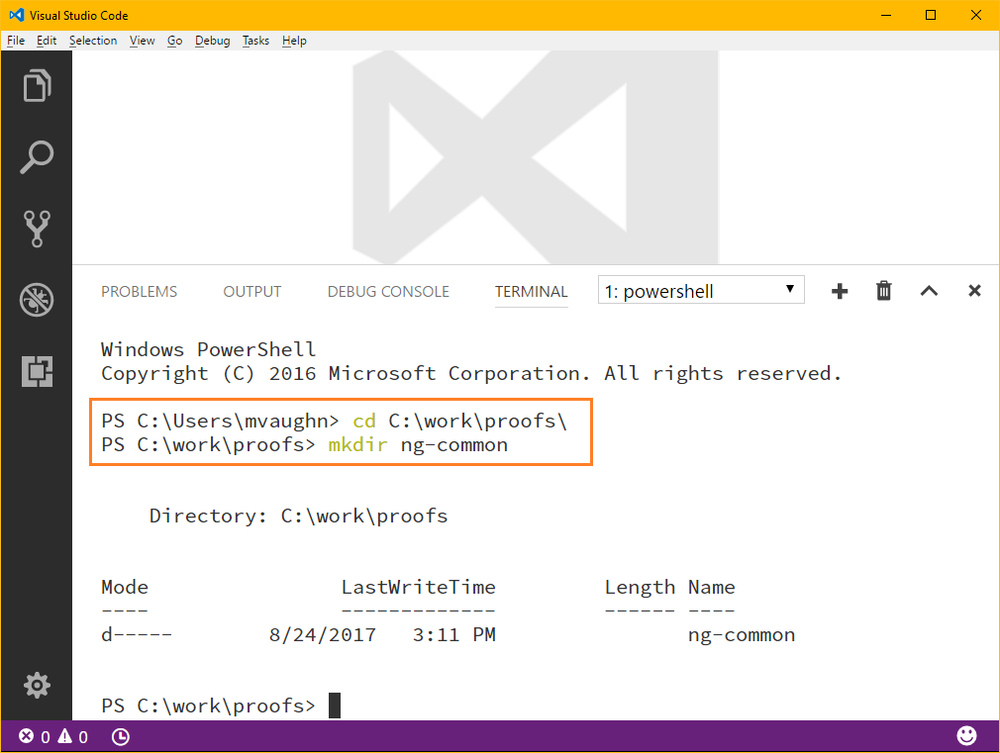

Now that we have a folder that will contain our module solution, open the folder using the option from the File menu. 

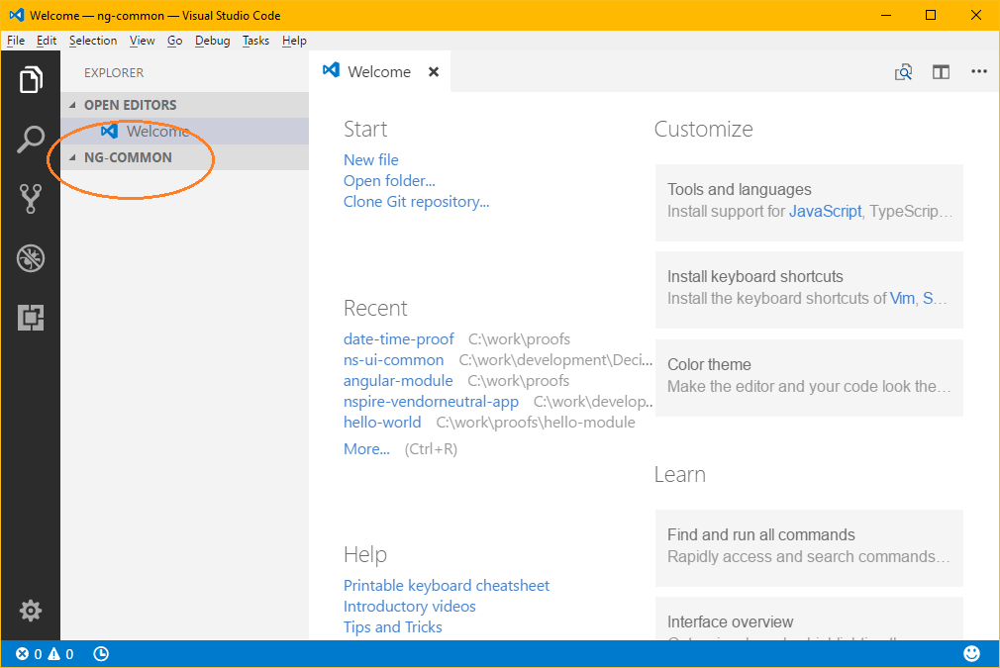

### 2. Create package.json for Module
We will use a ` package.json ` file to set name, version, and also to reference package dependencies required for the module. 

Open the Powershell Terminal and run the following command. This will create the ` package.json ` file. 

```script
npm init
```

The ` npm init ` command creates a new ` package.json ` file after guiding through a few prompts for information about the package. This file is required when you want to use and or publish your package. 

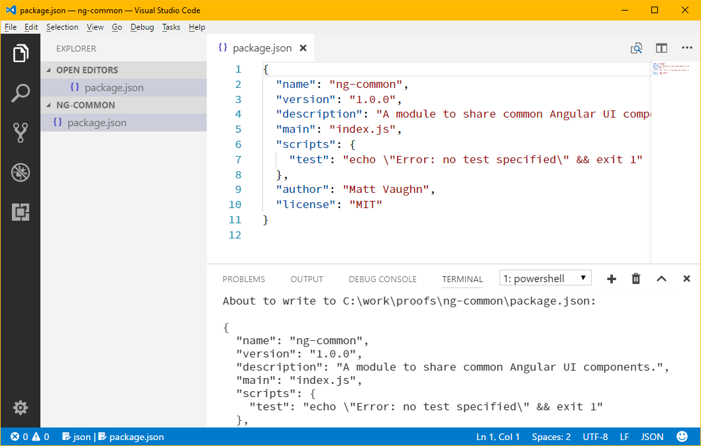

### 3. Create tsconfig.json for Module Project
Run the following command to add a new ` tsconfig.json ` file to the project. We will need to update the default information - however, getting the file created is half the battle.

```
tsc --init
```

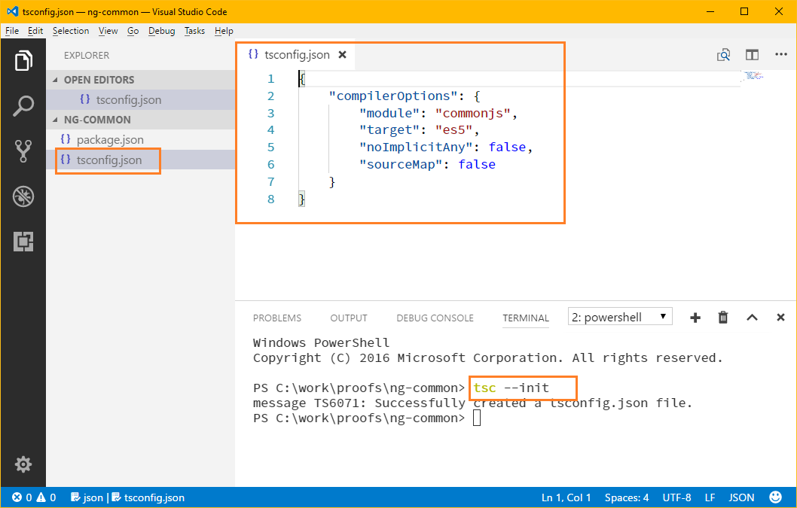

#### Compiler Options for tsconfig.json
There are quite a few compiler options available. Update the new ` tsconfig.json ` file with the following configuration shown below. Find more information about options here: [Typescript Compiler Options](https://www.typescriptlang.org/docs/handbook/compiler-options.html)

* **declaration**: Generates corresponding .d.ts file.
* emitDecoratorMetadata: Emit design-type metadata for decorated declarations in source. 
* **experimentalDecorators**: Enables experimental support for ES decorators.
* **inlineSources**: Emit the source alongside the sourcemaps within a single file; requires --inlineSourceMap or --sourceMap to be set.
* **mapRoot**: Specifies the location where debugger should locate map files instead of generated locations. Use this flag if the .map files will be located at run-time in a different location than the .js files. The location specified will be embedded in the sourceMap to direct the debugger where the map files will be located.
* **module**: Specify module code generation.
* **moduleResolution**: Determine how modules get resolved. Either "Node" for Node.js/io.js style resolution, or "Classic". See Module Resolution documentation for more details.
* **noEmitOnError**: Do not emit outputs if any errors were reported.
* **noImplicitAny**: Raise error on expressions and declarations with an implied any type.
* **outDir**: 	Redirect output structure to the directory.
* **rootDir**: Specifies the root directory of input files. Only use to control the output directory structure with --outDir.
* **sourceMap**: Generates corresponding .map file.
* **target**: Specify ECMAScript target version.

```javascript
{
    "compileOnSave": true,
    "compilerOptions": {
        "declaration": true,
        "emitDecoratorMetadata": true,
        "experimentalDecorators": true,
        "inlineSources": true,
        "mapRoot": "/",
        "module": "commonjs",
        "moduleResolution": "node",
        "noEmitOnError": false,
        "noImplicitAny": false,
        "outDir": "dist",
        "rootDir": "src/app",
        "sourceMap": true,
        "target": "es6"
    },
    "formatCodeOptions": {
        "indentSize": 4,
        "tabSize": 4,
        "newLineCharacter": "\r\n",
        "convertTabsToSpaces": true,
        "insertSpaceAfterCommaDelimiter": true,
        "insertSpaceAfterSemicolonInForStatements": true,
        "insertSpaceBeforeAndAfterBinaryOperators": true,
        "insertSpaceAfterKeywordsInControlFlowStatements": true,
        "insertSpaceAfterFunctionKeywordForAnonymousFunctions": false,
        "insertSpaceAfterOpeningAndBeforeClosingNonemptyParenthesis": false,
        "placeOpenBraceOnNewLineForFunctions": false,
        "placeOpenBraceOnNewLineForControlBlocks": false
    },
    "exclude": [
        "node_modules",
        "dist"
    ]
}
```

### 4. Install NPM Packages
Since our module is for sharing common Angular components, we will install the following packages. Use the Powershell Terminal to run the following commands.

```
npm install --save --save-dev rxjs@^5.0.1
npm install --save --save-dev @angular/cli@latest	
npm install --save --save-dev @angular/core	
npm install --save --save-dev @angular/common
npm install --save --save-dev @angular/compiler
npm install --save --save-dev @angular/compiler-cli
```

Note, that the packages are only installed in the ` devDependencies ` section of the ` packages.json ` file. We only require the elements for development - we expect that the client Angular application will have the required package references in the ` dependencies ` of its packages.json file.

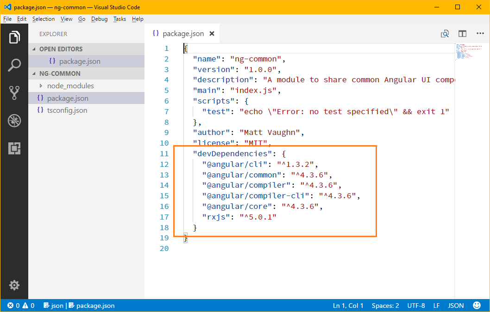

### 5. Create angular-cli.json for Module Project
Create/Add a new file called ` angular-cli.json ` in the root of the project folder. Add the following contents. 

You may need to update the ` project.name ` value to the name of the current module project you are working on. 

```javascript
{
    "project": {
        "version": "1.0.0",
        "name": "ng-common"
    },
    "apps": [
        {
            "tsconfig": "tsconfig.json",
            "mobile": false,
            "root": "src",
            "prefix": "app"
        }
    ],
    "defaults": {
        "styleExt": "css",
        "prefixInterfaces": false,
        "lazyRoutePrefix": "+"
    }
}
```

### 6. Angular Folders
By convention, Angular web applications use a specific folder structure. We also want to take advantage of the ` angular-cli ` tool to generate code for our project. Therefore, we will create a ` src\app ` folder structure for the Angular members of the project. 

### 7. Create index.ts File
This file is really the most important element of the solution. It will you to publicly expose (can I say that in technical documentation?) or allow clients to find the specified module of the package - which is very important to Angular applications.

The only project member we need to expose is the module itself. We will update this 

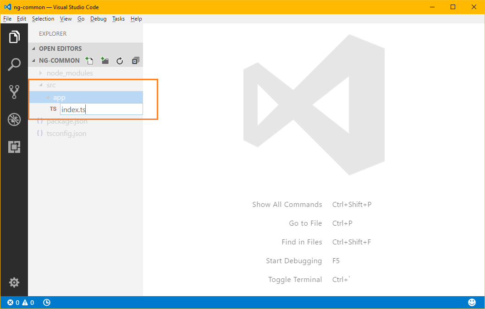

### 8. Create a Module
Now, the moment that we have been waiting for. Create a module that will provide access to all of the shared members (components, services, etc.) we'll create later.

Run the following command to create a new module with the name ` ngCommonModule `. Note that you do not have to include the ` Module ` suffix. The angular-cli tool will do that for you by convention. 

```javascript
syntax: ng generate module <NAME-OF-YOUR-MODULE>
example: ng generate module ngCommon
```

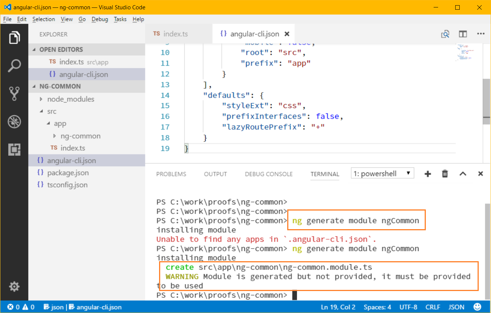


#### @NgModule
We will use the @NgModule declaration to add imported items to the ` imports `, ` declarations `, and ` exports `

```javascript
import { NgModule } from '@angular/core';
import { CommonModule } from '@angular/common';

@NgModule({
  imports: [
    CommonModule
  ],
  declarations: []
})
export class NgCommonModule { }
```

#### Update package.json With Module Name
The default name of the module is created when the ` package.json ` file is created. Now that we have a module and the client applications will reference the module by name, you will need to update the ` name ` setting in the ` package.json ` file before publishing the module.

```
old: ng-common
new: NgCommonModule
```

_Note: Later we will copy the ` package.json ` file to the output directory before publishing the module. The names should match in both files. _

```javascript
{
  "name": "NgCommonModule",
  "version": "1.1.1",
  "description": "A module to share common Angular UI components.",
  "main": "index.js",
  "scripts": {
    "test": "echo \"Error: no test specified\" && exit 1"
  },
  "author": "Matt Vaughn",
  "license": "MIT",
  "devDependencies": {
    "@angular/cli": "^1.3.2",
    "@angular/common": "^4.3.6",
    "@angular/compiler": "^4.3.6",
    "@angular/compiler-cli": "^4.3.6",
    "@angular/core": "^4.3.6",
    "rxjs": "^5.0.1"
  }
}
```

#### Export the Module :: index.ts
Add an ` export ` for the module in the ` index.ts ` file. When the module is compile, this will create an ` index.js ` file that is referenced as the ` main ` value in the package.json file.

```javascript
export * from './ng-common/ng-common.module';
```

_**NOTE**: Adding the ` export ` item for the module is required. Otherwise, 
the Angular client application will throw an exception stating that the 
ngCommonModule is not an @ngModule - basically, it cannot find it due 
to not being exported and referenced in the ` index.js `._

### 9. Add Some Resources to the Module
Now that we have a structure and process to create a module we are in a better place. Now you need to start thinking about the contents of the module. 

_Principle: A module should only contain related and like items that as a composite make up the module contents. A module should not be a _**"junk drawer"**_ that contains non-related items. _

For example, in our current Angular applications we have service and ui modules. The _UI modules_ contain components, routes, pipes, directives, and things related to the UI or display of content. We also have _service modules_ that contain Angular services, business logic code, HTTP services, rules and business actions. These services basically contain the _business logic_ of the application to enable a clear separation of concerns between the UI/UX and the business end of the application. 

My hope is that we can abstract the _service modules_ into separate and reusable modules. One scenario is that the service modules have the potential for reuse in other web and hybrid mobile applications. Another benefit, is that the unit and/or specification testing of service modules is simplified and targets/context of this type of testing is much different that UI testing. 

The next two sections talk about _ui modules_ and _service modules_. My opinion is that modules of these types should not be combined into a single module

#### UI Modules: Components and Angular "Things"
Use the ` angular-cli ` to create a component. Note that we are 
using the path ` ng-common\helloWorld ` - this allows the CLI to find and update the ` ngCommonModule ` with the component configuration (Why write code when you don't have to?):

1. import
2. declaration
3. export 

```
ng generate component ng-common\helloWorld
```
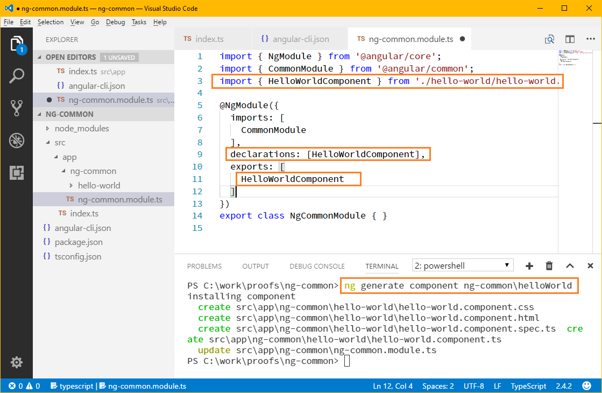

##### Declare and Export Components
If you want your components to be publicly exposed, or I should say available (sounds better), you will need to add the component to the ` exports ` array of the @ngModule.

Exporting, allows the component to be publicly available to applications that import/use this module. 

```javascript
@NgModule({
  imports: [
    CommonModule
  ],
  declarations: [HelloWorldComponent],
  exports: [
    HelloWorldComponent
  ]
})
```

##### HelloWorldComponent
The ` HelloWorldComponent ` is created in its own folder using the same conventions we are used to when working with an Angular application. We have:

* a ` component ` class with an ` @Component ` decorator.
* an HTML file that will render when the ` selector ` is used.
* a CSS file for styling the HTML.
* a ` specification test ` file to write specification tests.

```javascript
import { Component, OnInit } from '@angular/core';

@Component({
  selector: 'app-hello-world',
  templateUrl: './hello-world.component.html',
  styleUrls: ['./hello-world.component.css']
})
export class HelloWorldComponent implements OnInit {

  constructor() { }

  ngOnInit() {
  }

}
```

##### What to do about HTML and CSS files?
In a typical Angular application, a component references the HTML and CSS files in the ` @Component ` decorator. For shared module packages (which are not Angular applications) it is best to include the HTML and CSS as inline text in the @Component decorator. Otherwise, you will need to implement a more elaborate build scheme that will bundle and/or inline the file contents for you. 

My opinion is that the Angular CLI should have the ability and feature to create a stand alone module without requiring the context of being within an Angular application. There are requests for this feature - however, not much activity from the team managing the Angular CLI tool. It is nice that we _**CAN**_ use the CLI to create feature and service modules in existing Angular applications. But the point of even having the concept of modules is that they can be reused and shared. If they are stuck in the muck of a single application you have the temptation of copying the folders/files into a new project. And if you do that (I'm guilty of this from time to time), beware trouble is lurking and it will find you!

#### Service Modules: Services, Business Providers, Actions, and Rules...
Use the information in this section if you building a _service module_ - a module that is basically an entry point into your business logic with a service API-like abstraction. The service APIs provide a facade pattern implementation that delegate the real concrete business logic in other classes below the service. 

Each consumer of the service (most likely an Angular Component) will only have direct access to the service of the module. Access to things internal should not be allowed. For example, you do not want the components to directly interact with or have access to:

* Business Providers
* Business Actions
* Business Rules
* Http Providers/Services that interact with the web services or Web APIs

Our web team has current standards, patterns, and practices for implementing business logic in our Angular applications. With that said, there may be some things that you want to make publicly accessible 

### 10. Compiling and Publishing the Module
We now have a module with something that can be reused - everyone wants the awesome ` HelloWorldComponent `, right? You get the point - you can now create as many reusable components as you want. 

Let's compile something so we can use the module. Typically within Visual Studio Code you can use the command below to run the build task. 

```javascript
SHIFT+CTRL B
```

However, when we use this command, the tool asks you to select the specified build task. Usually, the ` tsc: build - tsconfig.json ` option from your ` tsconfig.json ` file. This will work every time. 

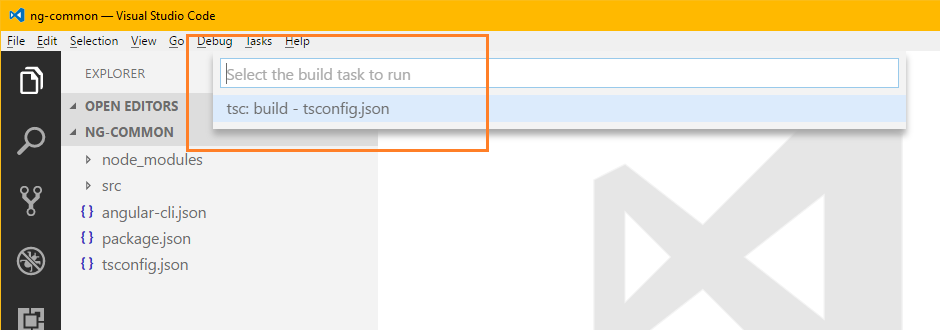

#### Alternate: Configure a Default Build Task
Use the ` CTRL + P ` command to show the command pallete. Enter ` task ` to display the ` Tasks ` options. Select the ` Tasks: Configure Default Build Task `. 

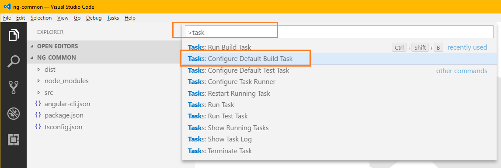

Select the option ` tsc: build -tsconfig.json ` as your option. This will configure the task to use the ` tsconfig.json ` when building the code with the ` tsc ` Typescript compiler. 

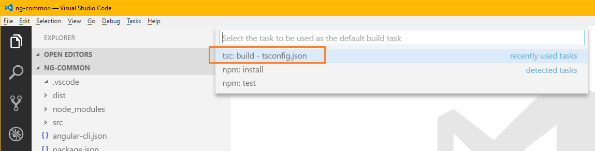

This will create a `tasks.json` file in the .vscode folder of your project. 

```javascript
{
    // See https://go.microsoft.com/fwlink/?LinkId=733558
    // for the documentation about the tasks.json format
    "version": "2.0.0",
    "tasks": [
        {
            "type": "typescript",
            "tsconfig": "tsconfig.json",
            "problemMatcher": [
                "$tsc"
            ],
            "group": {
                "kind": "build",
                "isDefault": true
            }
        }
    ]
}
```
#### Compiled Output
The compiled output of the build is in the ` dist ` folder of the project. The output directory is configured in the ` tsconfig.json `.` outDir ` setting.

#### Distribution package.json Configuration
In order for other applications to use the module package, the module must contain a ` package.json ` file. You can copy the ` package.json ` file from the root of the project to the ` dist ` folder. 

The initial file should have a version of ` 1.0.0 `. You may want to modify the version of the module package when new features, components, or bug fixes occur. You can use the ` npm ` command to update the version:

```javascript
Syntax: npm version [patch|minor|major]
npm version patch
npm version minor
npm version major
```

The following shows the usage of the npm command and the changes in the version of the module package. How you use versioning is up to you and/or your team. Please remember, that the version and how your package is referenced by clients will have an impact on the applications that will use your module. 

Make sure that you are running the `npm version` command from the ` dist ` folder so that the correct ` package.json ` file is updated. Or, you may want to update the source file and have an XCOPY process that copies the file to the ` dist ` folder during builds - they should probably be kept in sync. 

```
PS C:\work\proofs\ng-common>
PS C:\work\proofs\ng-common>
PS C:\work\proofs\ng-common> cd .\dist\
PS C:\work\proofs\ng-common\dist> npm version patch
v1.0.1
PS C:\work\proofs\ng-common\dist> npm version minor
v1.1.0
PS C:\work\proofs\ng-common\dist> npm version major
v2.0.0
```

## Using the Module
In order to use the module, you will need to create or configure an existing Angular web application. The most common way to use a package module is to install it using ` npm install <myModuleName> `. 

```
npm install angular-rules-engine@0.0.27 --save --save-dev
```

This will work if you publish the package to an npm repository like [https://www.npmjs.com/](https://www.npmjs.com/). For modules that you want to share with the world - this is a great way to do it. 

For example, our team uses the [angular-rules-engine](https://www.npmjs.com/package/angular-rules-engine) npm package developed and maintained by one of team members (me).

If you do not need to or do not want to make your module publicly available, you can publish the contents of the ` dist ` folder from the module project to a location accessible via file path/network share to the Angular application under consideration. 

For example, our team will publish modules to an ` ng-resources ` folder. This folder can be version controlled and updated when and if newer versions are made available. You can also create folders that have ` version ` information so that you can maintain and use more than one version of the module. 

### Update package.json with Reference to Module
You can add a reference to the ` devDependecies ` and/or the ` dependencies ` settings in the applications ` package.json ` file. 

```
"NgCommonModule": "../ng-resources/ng-common"
```

You will need to run the ` npm install ` command so that the module is found and is added to the applications ` node_modules ` folder. 

``` 
npm install
```

If the ` install ` command did its job, you will the name and version of the referenced module package in the Powershell Terminal window. If you increment the version of the module and publish, you can run the same ` npm install ` command - this will allow the client application to pick up the new version and update the ` node_modules ` with the correct version. If you do not see the reference to the updated version in the output window, you may need to delete/remove the module folder from ` node_modules ` and run the ` npm install ` command again.

```
PS C:\work\proofs\help> npm install
help@0.0.0 C:\work\proofs\help
`-- NgCommonModule@1.0.0
```

#### Update the Application Module References
The shared module should be imported by the client application. 

**References:**
```
import { NgCommonModule } from 'NgCommonModule/ng-common/ng-common.module';
import { HelloWorldComponent } from 'NgCommonModule/ng-common/hello-world/hello-world.component';
```

**app.module.ts**
```
import { BrowserModule } from '@angular/platform-browser';
import { NgModule } from '@angular/core';

import { AppComponent } from './app.component';

import { NgCommonModule } from 'NgCommonModule/ng-common/ng-common.module';
import { HelloWorldComponent } from 'NgCommonModule/ng-common/hello-world/hello-world.component';

@NgModule({
  declarations: [
    AppComponent
  ],
  imports: [
    BrowserModule,
    NgCommonModule
  ],
  exports: [
    HelloWorldComponent
  ],
  providers: [],
  bootstrap: [AppComponent]
})
export class AppModule { }

```

#### Add the Component to the HTML
You can add the ` selector ` of any component made available by the shared module. In the client application, update a component's HTML file with the following selector.

```
<app-hello-world></app-hello-world>
```

#### Running the App
You should be able to run the application and see the HTML from the shared component. 

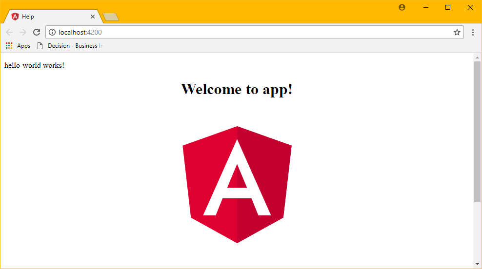

#### Kill port 4200
Use the following command below to find and kill a process running a designated port. 

```
netstat -ano | findstr :4200
```

```
result:
TCP    127.0.0.1:4200         0.0.0.0:0              LISTENING       39720
```

```
example (kills process indicated above):
taskkill /PID 39720 /F
```